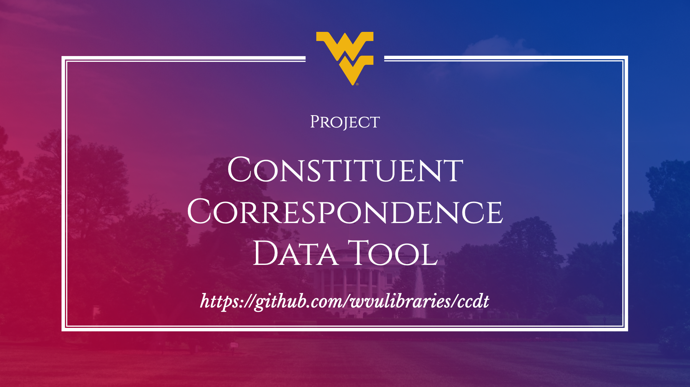

[Constituent Correspondence Data Tool](https://github.com/wvulibraries/ccdt) is a platform to transform **congressional data** into **information** and **information** into **insights.** The projects aims to provide a holistic interface for importing `flat-files` and provide tools to **research and visualize.**

## Status

## Quick Start

 [Presentation](https://docs.google.com/presentation/d/1FyzvqbXJCVkH5S1Af2u6OOTHvzqgfDztlYbq4fLybr4/edit?usp=sharing) | [Documentation](https://github.com/wvulibraries/ccdt/wiki)
------------ | -------------
  | 

## Development and Contributing

## PHPUnit

To Run tests exec into the main ccdt docker container
`docker exec -it ccdt_php bash`

Then run the following command
`vendor/bin/phpunit` 

**Ideas/Bugs/Questions**

Feel free to share ideas/bugs/questions using [issues](https://github.com/wvulibraries/ccdt/issues)

**Author(s)**

[Ajay Kavui](http://pseudoaj.com) ([@pseudoaj](https://github.com/pseudoaj))
[Tracy McCormick](http://tracyamccormick.com) ([@trmccormick](https://github.com/trmccormick))

**Team**

[WVU Libraries Systems Department](https://lib.wvu.edu/about/directory/departments/68/employees/)

**Contributors**

Following are the contributors for the project: [contributors](https://github.com/wvulibraries/ccdt/graphs/contributors)
